  

<picture>
  <source
    media="(prefers-color-scheme: dark)"
    srcset="./dark.svg">
  <source
    media="(prefers-color-scheme: light)"
    srcset="./light.svg">
  
</picture>

  

<h3>AI Engineer | Agentic & Multimodal Systems</h3>

  

 

<picture>
  <source
    media="(prefers-color-scheme: dark)"
    srcset="https://raw.githubusercontent.com/nameershah/nameershah/output/github-contribution-grid-snake-dark.svg">
  <source
    media="(prefers-color-scheme: light)"
    srcset="https://raw.githubusercontent.com/nameershah/nameershah/output/github-contribution-grid-snake.svg">
  
</picture>

